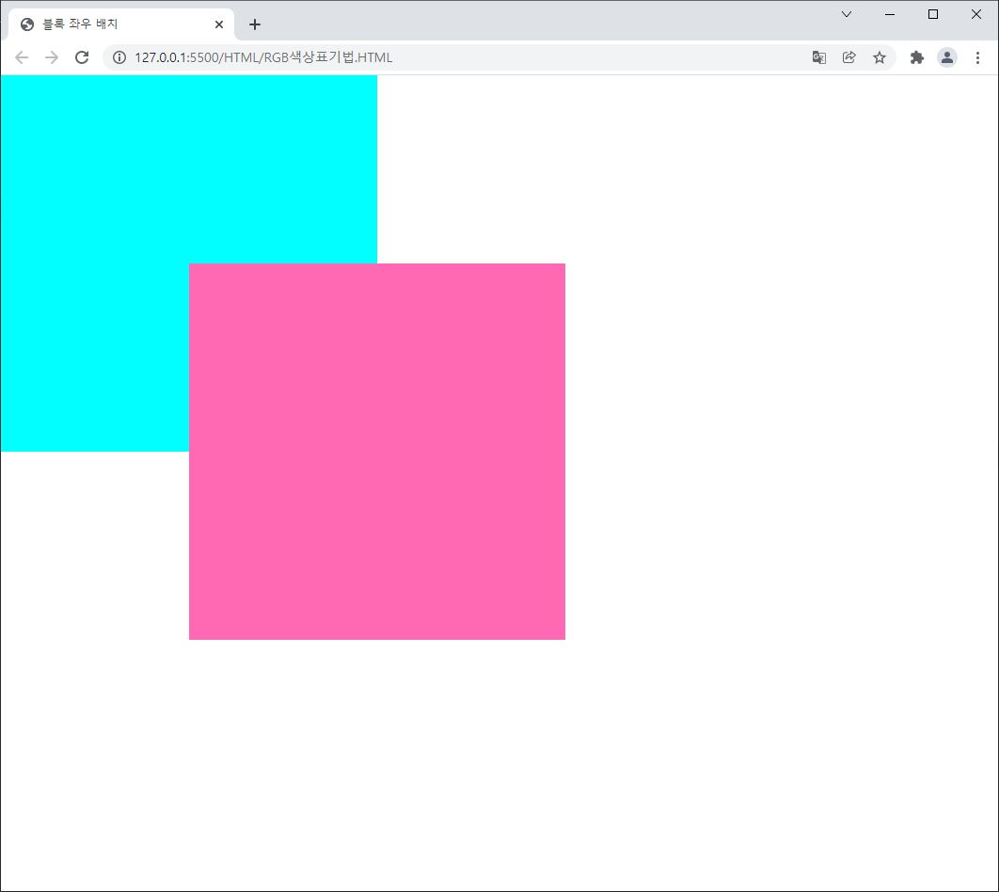
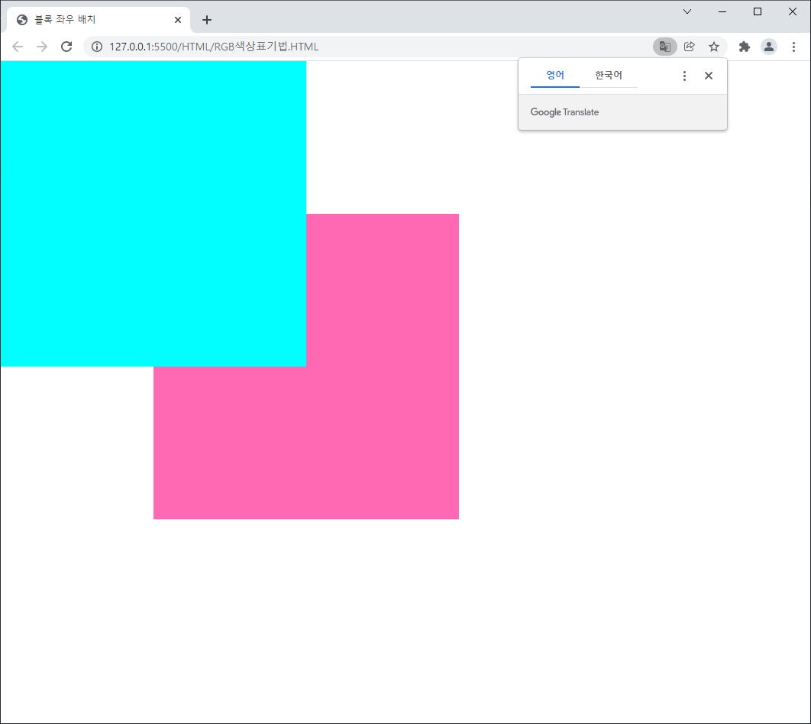

# CSS

HTML 문서에 stylesheet를 연결하여, 문서를 디자인할 수 있다.

방법 : `head` 태그 내의 `link` 태그를 선언하여 css를 연결한다.

HTML file 구성

```html
<!DOCTYPE html>
<html lang="en">
<head>
    <!-- meta 태그 생략 -->
    <link rel="stylesheet" href="이 곳에 경로를 지정" />
    <title>Document</title>
</head>
<body>

</body>
</html>
```

style.css 구성

```css
@charset "UTF-8"; /* 인코딩 지정 */
```

### 블록요소와 인라인 요소

#### 블록요소

- `h1~h6, p, ul, ol, dl, div`
- 자동 줄바꿈
- 넓이 값 미 지정시 부모요소의 넓이 값을 100% 상속받음
- 넓이와 높이 값 크기를 지정 가능
- 블록요소는 자식요로소 블록, 인라인 요소를 모두 감쌀 수 있음

#### 인라인 요소

- `a, strong, em`
- 자동 줄바꿈이 안되고 옆으로 붙음
- 넓이 값 미 지정시 인라인 요소 태그로 감싼 컨텐츠가 자신의 크기
- 넓이와 높이 값 크기 지정이 불가능
- 인라인 요소는 인라인 요소만 감쌀 수 이삳.

### 서식 관련 CSS

- `font-weight` : 글자의 굵기
  
  - `h1` 태그의 `font-weight` 옵션의 기본 값은 bold

- `font-size` : 글자의 크기
  
  - 기본 값 : 16px

- `line-height` : 줄 간격 값
  
  - 일반적으로 고정 값을 주는 것보단, 실수 값으로 글자의 비율을 통해 조정 

- `font-family` : 글꼴 설정

- `color` : 글자 색 설정

- `text-align` : 정렬
  
  - 기본 값 : `left`
  - 가운데 정렬 : `center`
  - 양쪽 정렬 : `justify`

- `letter-spacing` : 자간 설정

- 서식 관련 css는 하나의 구문으로 축약할 수 있다.
  
  ```css
  font : normal 30px/1.5 "arial";
  ```
  
  - normal은 생략 가능

### 배경 관련 CSS

- `width` : 넓이

- `height` : 높이

- `border` : 테두리 설정

- `background-color` : 배경색
  
  - 기본 값은 투명 색인 `transparent`

- `background-image` : 배경 이미지 설정
  
  ```css
  background-image: url(상대경로);
  ```

- `background-repeat` : 배경 반복 설정
  
  - `repeat-y` : y축으로만 repeat
  - `repeat-x` : x축으로만 repeat

- `background-position` : 배경 위치
  
  - 기본 값 : (0px, 0px)
  - `center`, `right` 같은 구문도 사용 가능

- `background-size` : 배경을 채우는 방식
  
  - `cover` : 이미지를 자르더라도 화면을 채움
  - `contain` : 여백이 남더라도 화면을 채움

- 축약형도 가능
  
  ```css
  background : pink url(상대경로) no-repeat center center/cover
  ```

### 바깥 여백 설정

- `margin` 태그를 이용하여 설정한다.
  
  1. 수치 값을 1개 설정할 경우, 상하좌우 바깥 여백이 각각 값이 적용된다.
  
  2. 수치 값을 2개 설정할 경우, (상하), (좌우) 바깥 여백이 각각 값이 적용된다.
     
     - 상하 값을 50px 주고 좌우 값을 auto를 주면 좌우 값을 균등하게 설정할 수 있다.
  
  3. 수치 값을 3개 설정할 경우, (위), (좌우), (아래)로 설정할 수 있다.
  
  4. 수치 값을 4개 설정할 경우, top, right, bottom, left(시계방향)으로 바깥 여백 값을 설정할 수 있다.

- `margin-bottom`과 같이 특정 방향으로도 줄 수 있다.

- 마진 겹침 현상
  
  ```html
  <!DOCTYPE html>
  <html lang="en">
      <head>
          <!-- 생략 -->
          <title>레이아웃 css</title>
      </head>
      <body>
          <div class="box1">box1</div>
          <div class="box2">box2</div>
      </body>
  </html>
  ```
  
  ```css
  .box1 {
      background-color: green;
      margin: 100px;
  }
  .box2 {
      background-color: red;
      margin: 100px;
  }
  ```
  
  - box1의 bottom과 box2의 top의 100px이 서로 겹치는 것을 확인할 수 있다.

### 안쪽 여백 설정

- `padding`태그를 사용하고, 코드 작성 과정은 바깥 여백 설정과 동일하다.
- `width`와 `height`의 값에 영향을 미친다.
  - `width` : 200, `height` : 200, `padding`: 50일 경우, `width`, `height`가 각각 +50

### 테두리 설정

- `border` 태그를 이용하여 설정한다.
  
  ```css
  /* 각각 설정 */
  border-width : 20px;
  border-style : dashed;
  border-color : red;
  /* 축약형 */
  border: 20px solid red;
  ```

- `padding`과 같이 `width`, `height` 값에 영향을 미친다.
  
  - 단 아래의 코드로 `width`, `height` 값에 영향을 안 줄수도 있다.
    
    `box-sizing: border-box;`

### 요소 가로 가운데 배치

- 블록 요소 안쪽에 있는 인라인 요소를 가로 가운데 배치할 경우
  - `text-align: center;`
- 블록 요소 자체를 가로 가운데 배치할 경우
  - `margin: 0px auto;`

### 자식콘텐츠 넘침 처리

- `overflow` 태그를 이용하여 처리한다.
  
  - 기본 값 : `visible`
  
  - `hidden` : 숨김
  
  - `auto` : 스크롤 생성

### RGB 색상표기법

- 아래의 태그를 이용하여 `rgb` 값을 셋팅할 수 있다.
  - `background-color : rgb(255, 255, 255);`
- 각 원소의 최댓값은 255
- 모든 원소를 최대로 주면 흰색으로 된다.
- 투명도를 설정하고 싶을 경우 `rgba`를 통해 셋팅할 수 있다.
  - `background-color : rgba(255, 255, 255, 1);`
  - a 값은 0과 1사이로 투명도를 설정할 수 있다.

### 16진수 색상 표기법

- ```html
  <ul>
      <li>#000</li>
      <li>#111</li>
      <li>#222</li>
      <li>#333</li>
      <li>#444</li>
      <li>#555</li>
      <li>#666</li>
      <li>#777</li>
      <li>#888</li>
      <li>#999</li>
      <li>#AAA</li>
      <li>#bbb</li>
      <li>#ccc</li>
      <li>#ddd</li>
      <li>#eee</li>
      <li>#fff</li>
  </ul>
  ```

- ```css
  ul li:nth-of-type(1) {
      background-color: #000;
  }
  ul li:nth-of-type(2) {
      background-color: #111;
  }
  ul li:nth-of-type(3) {
      background-color: #222;
  }
  ul li:nth-of-type(4) {
      background-color: #333;
  }
  ul li:nth-of-type(5) {
      background-color: #444;
  }
  ul li:nth-of-type(6) {
      background-color: #555;
  }
  ul li:nth-of-type(7) {
      background-color: #666;
  }
  ul li:nth-of-type(8) {
      background-color: #777;
  }
  ul li:nth-of-type(9) {
      background-color: #888;
  }
  ul li:nth-of-type(10) {
      background-color: #999;
  }
  ul li:nth-of-type(11) {
      background-color: #aaa;
  }
  ul li:nth-of-type(12) {
      background-color: #bbb;
  }
  ul li:nth-of-type(13) {
      background-color: #ccc;
  }
  ul li:nth-of-type(14) {
      background-color: #ddd;
  }
  ul li:nth-of-type(15) {
      background-color: #eee;
  }
  ul li:nth-of-type(16) {
      background-color: #fff;
  }
  ```

### 자동 완성 기능

- vscode에서 편하게 자동 완성 하는 방법 정리
  
  `ul>li>span`
  
  ```html
  <ul>
      <li><span></span></li>
  </ul>
  ```
  
  `ul>li*5`
  
  ```html
  <ul>
      <li></li>
      <li></li>
      <li></li>
      <li></li>
      <li></li>
  </ul> 
  ```
  
  `.box`
  
  ```html
  <div class="box"></div>
  ```
  
  `#box`
  
  ```html
  <div id="box"></div>
  ```
  
  `a[href="https://naver.com"]`
  
  ```html
  <a href="https://naver.com"></a>
  ```
  
  `a[href="#"]{link}`
  
  ```html
  <a href="#">link</a>
  ```
  
  `p>lorem5`
  
  ```html
  <p>Lorem ipsum dolor sit amet.</p>
  ```
  
  `ul>li.box$*3`
  
  ```html
  <ul>
      <li class="box1"></li>
      <li class="box2"></li>
      <li class="box3"></li>
  </ul>
  ```
  
  `ul>li.box$*3{list$}`
  
  ```html
  <ul>
      <li class="box1">list1</li>
      <li class="box2">list2</li>
      <li class="box3">list3</li>
  </ul>
  ```
  
  `dl>(dt+dd)*3`
  
  ```html
  <dl>
      <dt></dt>
      <dd></dd>
      <dt></dt>
      <dd></dd>
      <dt></dt>
      <dd></dd>
  </dl>
  ```
  
  `h1>lorem5^p>lorem8`
  
  ```html
  <h1>Lorem ipsum dolor sit amet.</h1>
  <p>Lorem ipsum dolor sit amet consectetur, adipisicing elit.</p>
  ```

### css 초기화

- 브라우저 초기 바깥여백과 안쪽 여백 초기화
  
  ```css
  * {
      margin: 0px;
      padding: 0px;
  }
  ```

- `ul`, `ol` 스타일 초기화
  
  ```css
  ul, ol {
      list-style: none;
  }
  ```

- `a` 스타일 초기화
  
  ```css
  a {
      text-decoration : none;
  }
  ```

### float을 활용하여 블록요소 좌우 배치하기

- 블록 요소는 자동 줄바꿈되기 때문에 좌우배치가 안된다.

- flex 를 통해서 효율적으로 배치할 수 있지만, flex가 없던 과거에는

- float을 이용하여 블록 요소를 좌우로 배치했고,

- 이 때문에 아직도 현업에서 float을 이용하는 곳이 있다.
  
  코드 보기
  
  ```html
  <!DOCTYPE html>
  <html lang="en">
      <head>
          <meta charset="UTF-8" />
          <meta http-equiv="X-UA-Compatible" content="IE=edge" />
          <meta name="viewport" content="width=device-width, initial-scale=1.0" />
          <link rel="stylesheet" href="../css/style.css" />
          <title>블록 좌우 배치</title>
      </head>
      <body>
          <div class="wrap">
              <div class="left"></div>
              <div class="right"></div>
          </div>
      </body>
  </html>
  ```
  
  ```css
  @charset "UTF-8"; /* 인코딩 지정 */
  
  /* reset CSS */
  * {
      margin: 0px;
      padding: 0px;
  }
  .wrap {
      width: 800px;
      border: 10px solid #000;
      margin: 100px auto;
  }
  
  .wrap .left {
      width: 400px;
      height: 400px;
      background: aqua;
  }
  
  .wrap .right {
      width: 400px;
      height: 400px;
      background: hotpink;
  }
  ```

- 좌우 배치를 하기 위해 css에서 `.wrap .left`와 `.wrap .right`에 `float` 속성을 다음과 같이 부여한다.
  
  ```css
  .wrap .left {
      width: 400px;
      height: 400px;
      background: aqua;
      float: left;
  }
  
  .wrap .right {
      width: 400px;
      height: 400px;
      background: hotpink;
      float: right;
  }
  ```

- 문제점
  
  - 좌우배치는 잘 됐지만, 강제로 띄워서 좌우배치했으므로,
  - 부모요소가 left, right의 높이를 인지하지 못하므로 감싸지 못한다.

- 해결 방법
  
  1. 부모 태그의 강제 높이 값 지정
     
     - 반응형에 대응할 수 없다.
     
     ```css
     .wrap {
         width: 800px;
         height: 400px;
         border: 10px solid #000;
         margin: 100px auto;
     }
     ```
  
  2. 부모 요소에 `overflow: auto;` 지정
     
     - 특정 브라우저에서 지원 x
     
     ```css
     .wrap {
         width: 800px;
         overflow: auto;
         border: 10px solid #000;
         margin: 100px auto;
     }
     ```
  
  3. 부모 요소에 `overflow: hidden;` 지정
     
     - 내부의 자식 콘텐츠가 잘리는 경우가 발생함.
     
     ```css
     .wrap {
         width: 800px;
         overflow: hidden;
         border: 10px solid #000;
         margin: 100px auto;
     }
     ```
  
  4. 부모 요소에 `float` 요소 지정
     
     - 가운데에 배치하기가 애매해진다.
  
  5. 임의의 `div` 태그 설정 & `clear: both;`
     
     - 불필요한 태그와 css 설정해야함
       
       ```html
       <div class="wrap">
           <div class="left"></div>
           <div class="right"></div>
           <div class="bottom"></div>
       </div>
       ```
       
       ```css
       .wrap .bottom {
           width: 800px;
           height: 100px;
           background: lightgreen;
           clear: both;
       }
       ```
     
     - `clear: both;`를 설정하지 않으면, left, right를 제외한 bottom만 부모 요소로 감싸짐
  
  6. 가상선택자 사용 (권장사항)
     
     - 5번과 동작은 같으나, 개선된 방식
     
     ```css
     .wrap::after { /* 인라인 요소임 */
         content: "";
         display: block; /* 블록화 시키기  */
         clear: both; /* after라는 가상의 부분까지 부모 요소로 감싼다.`
     }
     ```

### 가상 선택자

- css 태그 뒤 `::before`, `::after` 등을 붙여서 꾸며주기 효과를 나타낼 때 주로 사용

- `content`를 집어넣을 순 있지만, 웹 접근성을 고려하여 넣지 않는다.
  
  - 시각 장애인이 사용하는 스크린-리더기에서 인식을 할 수 없음

- 마우스를 올렸을 때 색 변경
  
  ```css
  div:hover {
      background: red;
  }
  ```

### position

- `position: relative;` : 현재 레이아웃에 영향을 미치지 않고, 자기 자신만 움직일 수 있도록 설정하는 것

- `position: absolute;` : **position 값이 있는** 부모 요소를 기준으로, 위치를 지정

- `position: fixed;` : 브라우저 기준으로 좌표 값을 고정

### z-index

- 작성된 순서가 아닌, `z-index`를 통해 먼저 보여주는 기능
  
  ```html
  <!DOCTYPE html>
  <html lang="en">
      <head>
          <meta charset="UTF-8" />
          <meta http-equiv="X-UA-Compatible" content="IE=edge" />
          <meta name="viewport" content="width=device-width, initial-scale=1.0" />
          <link rel="stylesheet" href="../css/style.css" />
          <title>z-index 실습</title>
      </head>
      <body>
          <div class="box1"></div>
          <div class="box2"></div>
      </body>
  </html>
  ```
  
  ```css
  .box1 {
      width: 400px;
      height: 400px;
      background: aqua;
      position: absolute;
      top: 0px;
      left: 0px;
      z-index: 2;
  }
  
  .box2 {
      width: 400px;
      height: 400px;
      background: hotpink;
      position: absolute;
      top: 200px;
      left: 200px;
      z-index: 1;
  }
  ```

### opacity 투명도 설정

- `opacity : value;`로 설정할 수 있다.
- `value`의 경우 0~1 사이의 값으로 설정한다.
- 0은 투명, 1은 불투명

### rem, em 글자크기 관련 단위

- `em`보다 `rem`을 많이 사용함

- 전반적으로 값을 키울 때 `rem`을 사용
  
  ```html
  html {
      font-size: 16px; /* 기본 값*/
  }
  ```
  
  ```css
  h1 {
      font-size: 3rem; /* html의 font-size 값의 3배로 지정하는 방법*/
  }
  ```

- Client가 전반적으로 글자 크기를 조정하고 싶어할 때, `html`의 `font-size`만 수정하여 반영할 수 있다.

- `em`의 경우 부모의 값에 비율로 조정되는 방식
  
  ```css
  html {
      font-size: 16px;
  }
  
  div {
      font-size: 40px;
  }
  
  div h1 {
      font-size: 3em; /* div의 font-size(40px)의 3배*/
  }
  
  div p {
      font-size: 1em; /* div의 font-size(40px)의 1배*/
  }
  
  div a {
      font-size: 0.8em; /* div의 font-size(40px)의 0.8배*/
  }
  ```

### vw,vh,vmin,vax 화면크기관련단위

- v는 viewport의 의미

- `vw`는 화면 브라우저의 너비 값을 100등분하여 크기만큼 지정함

- `vh`는 화면 브라우저의 높이 값을 100등분하여 크기만큼 지정함

- `vmin`는 화면 브라우저의 높이와 너비 중 작은 값을 기준으로 크기를 조정

- `vmax`는 화면 브라우저의 높이와 너비 중 큰 값을 기준으로 크기를 조정

- 글자, 이미지, 동영상 등 최적화된 사이즈를 제공하고 싶을 때 사용
